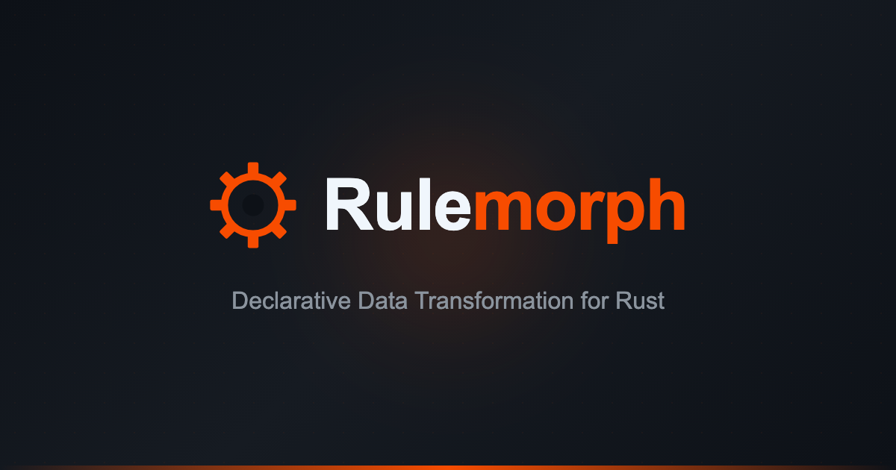

<p align="center">
  
</p>

<p align="center">
  <a href="https://crates.io/crates/rulemorph"></a>
  <a href="https://docs.rs/rulemorph"></a>
  <a href="LICENSE"></a>
</p>

A Rust CLI and library to transform CSV/JSON data into JSON using declarative YAML rules. Ideal for normalizing API responses, converting between data formats, and building consistent data pipelines.

## Features

- **Input formats**: CSV and JSON with nested record extraction
- **Rule-based mapping**: Declarative YAML rules with static validation
- **Expressions (v2 pipe syntax)**: trim/lowercase/uppercase/concat, add/multiply, coalesce, lookup/lookup_first, plus `let`/`if`/`map` steps
- **Lookups**: Array lookups from external context data (lookup, lookup_first)
- **Conditions**: Conditional mapping with comparisons, regex, and logical ops
- **DTO generation**: Generate type definitions for Rust, TypeScript, Python, Go, Java, Kotlin, Swift
- **UI/API server**: Serve the UI and `/api/*` locally (defined by YAML)
- **MCP server**: Available as a Model Context Protocol server for AI assistants

## Installation

Choose the section that matches your use case.

### CLI (most users)

The command-line tool for transforming data and generating DTOs. This does not include the UI/API server (use `rulemorph-server` if needed).

Homebrew (recommended):

```sh
brew install vinhphatfsg/tap/rulemorph
```

Prebuilt binaries (GitHub Releases):

- macOS (Apple Silicon): `rulemorph-<TAG>-aarch64-apple-darwin.tar.gz`
- macOS (Intel): `rulemorph-<TAG>-x86_64-apple-darwin.tar.gz`
- Linux (x86_64): `rulemorph-<TAG>-x86_64-unknown-linux-gnu.tar.gz`
- Windows (x86_64): `rulemorph-<TAG>-x86_64-pc-windows-msvc.zip`

From source:

```sh
cargo build -p rulemorph_cli --release
./target/release/rulemorph --help
```

### UI / API Server

A web UI and server that exposes `/api/*` defined by YAML rules. The UI is embedded in the binary, and you can override it with `--ui-dir`.

Homebrew (recommended):

```sh
brew install vinhphatfsg/tap/rulemorph-server
```

Prebuilt binaries (GitHub Releases):

- `rulemorph-server-<TAG>-<TARGET>.tar.gz` / `.zip`

From source:

```sh
cargo run -p rulemorph_server -- --help
```

Example with a rules directory:

```sh
rulemorph-server --rules-dir ./api_rules --api-mode rules
```

For full startup steps, see [UI Server Guide](docs/guide/ui-run-and-verify-en.md).

### MCP Server

A [Model Context Protocol](https://modelcontextprotocol.io/) server for AI assistant integration (Claude Code, Claude Desktop, etc.).

Prebuilt binaries (GitHub Releases):

- `rulemorph-mcp-<TAG>-<TARGET>.tar.gz` / `.zip`

From source:

```sh
cargo run -p rulemorph_mcp -- --help
```

See [MCP Server](#mcp-server) section for usage.

### Rust Library

Embed Rulemorph in your Rust application.

Add to your `Cargo.toml`:

```toml
[dependencies]
rulemorph = "0.2.1"
```

## Quick Start

Transform user data from an external API response to your schema:

**rules.yaml**
```yaml
version: 2
input:
  format: json
  json:
    records_path: "users"
mappings:
  - target: "id"
    source: "user_id"
  - target: "name"
    expr:
      - "@input.full_name"
      - trim
  - target: "email"
    expr:
      - "@input.username"
      - concat: ["lit:@example.com"]
```

**input.json**
```json
{ "users": [{ "user_id": 1, "full_name": "Alice", "username": "alice" }] }
```

**Run**
```sh
rulemorph transform -r rules.yaml -i input.json
```

**Output**
```json
[{ "id": 1, "name": "Alice", "email": "alice@example.com" }]
```

## Rule Structure

> **Note:** `version: 2` is recommended. Version 1 syntax is deprecated.

```yaml
version: 2
input:
  format: json|csv
  json:
    records_path: "path.to.array"  # Optional
mappings:
  - target: "output.field"
    source: "input.field"    # OR value: <literal> OR expr: <pipe>
    type: string|int|float|bool
    when:
      eq: ["@input.status", "active"]  # Optional condition
```

Note: v2 condition comparisons are type-sensitive (`"1"` != `1`). Ordering (`gt/gte/lt/lte`) compares numerically when possible, otherwise compares strings lexicographically.

For the full rule specification, see [Rule Specification](docs/rules_spec_en.md).

## DTO Generation

Generate type definitions from your rules:

```sh
rulemorph generate -r rules.yaml -l typescript
```

Output:
```typescript
export interface Record {
  id: number;
  name: string;
  email: string;
}
```

Supported languages: `rust`, `typescript`, `python`, `go`, `java`, `kotlin`, `swift`

## Library Usage (Rust)

```rust
use rulemorph::{parse_rule_file, transform};

let rule = parse_rule_file(&std::fs::read_to_string("rules.yaml")?)?;
let input = std::fs::read_to_string("input.json")?;

// Basic transformation
let output = transform(&rule, &input, None)?;

// With context data (for lookups and external references)
let context = serde_json::json!({ "rates": [{"code": "USD", "rate": 1.0}] });
let output = transform(&rule, &input, Some(&context))?;
```

## MCP Server

Rulemorph provides an [MCP (Model Context Protocol)](https://modelcontextprotocol.io/) server for AI assistant integration.

**Available tools:**
- `transform` - Execute data transformation
- `validate_rules` - Validate YAML rules
- `generate_dto` - Generate type definitions
- `analyze_input` - Summarize input data structure

**Setup with Claude Code:**

```sh
claude mcp add rulemorph -- rulemorph-mcp
```

**Setup with Claude Desktop:**

Add to your Claude Desktop config (`claude_desktop_config.json`):

```json
{
  "mcpServers": {
    "rulemorph": {
      "command": "rulemorph-mcp"
    }
  }
}
```

## UI / API Server Configuration

The server supports two modes:

| Mode | Description |
|------|-------------|
| `--api-mode rules` | UI + custom APIs defined by YAML rules (default) |
| `--api-mode ui-only` | UI only, no custom APIs |

**Options:**
- `--no-ui` - Disable the UI, serve only custom APIs
- `--data-dir <path>` - Data directory (default: `./.rulemorph`)
- `--rules-dir <path>` - API rules directory (default: `./.rulemorph/api_rules`)

**Running the server:**

```sh
# Release binary
rulemorph-server

# Development
cargo run -p rulemorph_server
```

See [UI Server Guide](docs/guide/ui-run-and-verify-en.md) for full setup instructions.

## Documentation

**Rule Specification:**
- [English](docs/rules_spec_en.md) | [日本語](docs/rules_spec_ja.md)

**UI Server Guide:**
- [English](docs/guide/ui-run-and-verify-en.md) | [日本語](docs/guide/ui-run-and-verify.md)

**UI Data Directory:**
- [English](docs/guide/ui-data-dir-usage-en.md) | [日本語](docs/guide/ui-data-dir-usage.md)
