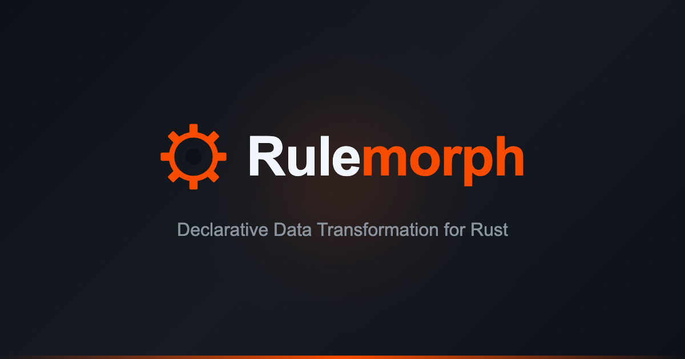

<p align="center">
  
</p>

<p align="center">
  <a href="https://crates.io/crates/rulemorph"></a>
  <a href="https://docs.rs/rulemorph"></a>
  <a href="LICENSE"></a>
</p>

Rulemorph transforms data from external APIs, CSV, JSON, YAML, TOML, XML, HTML, and Excel into predictable JSON using declarative YAML/JSON rules.

Instead of adding another custom script for every input source, you can keep transformation behavior in rule files. The same rules can be reused from the CLI, embedded in Rust, served through a local UI/API server, or exposed to AI assistants through MCP.

Try it in your browser: [playground.rulemorph.com](https://playground.rulemorph.com/)

## What It Solves

Rulemorph moves growing transformation code into reviewable, versioned rules.

- Normalize vendor API responses into your internal schema
- Bring CSV / Excel imports into a JSON pipeline
- Extract values from HTML or XML and process them with the same rule model
- Review, replace, and version transformation behavior as YAML/JSON
- Reuse the same transformation from the CLI, a local API, or an AI assistant

It is not meant to replace application code for arbitrary execution, complex domain logic, or long-running workflow orchestration. For those cases, normal application code or a workflow engine is usually a better fit.

## Quick Start

Transform a `users` array from an external API response into the JSON shape your application expects.

**rules.yaml**

```yaml
version: 2
input:
  format: json
  json:
    records_path: "users"
mappings:
  - target: "id"
    source: "user_id"
  - target: "name"
    expr: ["@input.full_name", trim]
  - target: "email"
    expr: ["@input.username", concat: ["lit:@example.com"]]
```

**input.json**

```json
{ "users": [{ "user_id": 1, "full_name": " Alice ", "username": "alice" }] }
```

**Run**

```sh
rulemorph transform -r rules.yaml -i input.json
```

You can also pipe input to `transform`:

```sh
cat input.json | rulemorph transform -r rules.yaml
cat input.json | rulemorph transform -r rules.yaml -i -
```

**Output**

<details>
<summary>Show output</summary>

```json
[{ "id": 1, "name": "Alice", "email": "alice@example.com" }]
```

</details>

For quick one-off transformations without a rule file, use direct mode.

Evaluate a single expression against JSON or ad-hoc CSV:

```sh
echo '{ "test": 1 }' | rulemorph -rule '@input.test'
echo '{ "a": 1, "b": 2 }' | rulemorph --rule '["@input.a", {"+": ["@input.b"]}]'
echo 'a,test,1' | rulemorph -rule '@input.0'
echo 'a,test,1' | rulemorph -H 'id,name,age' -rule '@input.id'
```

<details>
<summary>Show output</summary>

```text
1
3
"a"
"a"
```

</details>

Use `-F/--field` when you want a small output object and field order matters:

```sh
echo 'u1,Alice,42' | rulemorph -H 'id,name,age' \
  -F id='@input.id' \
  -F name='["@input.name","trim","uppercase"]' \
  -F age='["@input.age","int"]'
```

<details>
<summary>Show output</summary>

```json
{ "id": "u1", "name": "ALICE", "age": 42 }
```

</details>

Use `--output-map` when a compact nested target map is easier to read:

```sh
echo 'u1,Alice,42' | rulemorph -H 'id,name,age' \
  --output-map '{"user.id":"@input.id","user.name":["@input.name","trim"],"age":["@input.age","int"]}'
```

<details>
<summary>Show output</summary>

```json
{ "user": { "id": "u1", "name": "Alice" }, "age": 42 }
```

</details>

For multi-record direct input, add `--ndjson` to emit one JSON value per line:

```sh
printf 'u1,Alice,42\nu2,Bob,7\n' | rulemorph --ndjson -H 'id,name,age' \
  --output-map '{"id":"@input.id","age":["@input.age","int"]}'
```

<details>
<summary>Show output</summary>

```jsonl
{"age":42,"id":"u1"}
{"age":7,"id":"u2"}
```

</details>

Direct mode can also read CSV or Excel files. CSV headers are inferred from `.csv`
files; use `-H/--headers` for headerless CSV. For Excel, select the header row
and data range explicitly:

```sh
rulemorph --rule '@input.id' -i users.csv
rulemorph -H 'id,name,age' --rule '@input.id' -i headerless-users.csv
rulemorph --rule '@input.id' -i users.xlsx --excel-header-row 1 --excel-data-range A2:D20
```

<details>
<summary>Show output</summary>

```text
"u1"
"u1"
["u1","u2"]
```

</details>

<p align="center">
  
</p>


## Which Package To Use

| Goal | Use |
| --- | --- |
| Try rules without installing anything | [Rulemorph Playground](https://playground.rulemorph.com/) |
| File transforms, DTO generation, CI validation | `rulemorph` CLI |
| Embed transformations in a Rust application | `rulemorph` crate |
| Run the local UI or YAML-defined APIs | `rulemorph-server` |
| Use transforms, validation, and DTO generation from an AI assistant | `rulemorph-mcp` |

## Installation

Prebuilt binaries for the CLI, server, and MCP server are available from [GitHub Releases](https://github.com/vinhphatfsg/rulemorph/releases).

### CLI

```sh
brew install vinhphatfsg/tap/rulemorph
```

Build from source for development:

```sh
cargo build -p rulemorph_cli --release
./target/release/rulemorph --help
```

### UI / API Server

```sh
brew install vinhphatfsg/tap/rulemorph-server
rulemorph-server --rules-dir ./api_rules --api-mode rules
```

For full startup steps, see the [UI Server Guide](docs/guide/ui-run-and-verify-en.md).

### MCP Server

`rulemorph-mcp` exposes Rulemorph capabilities to AI assistants through the Model Context Protocol.

- `transform`: transform data
- `validate_rules`: validate rules
- `generate_dto`: generate DTOs
- `analyze_input`: summarize input structure

Claude Code setup:

```sh
claude mcp add rulemorph -- rulemorph-mcp
```

## Key Features

- Normalize CSV / JSON / YAML / TOML / XML / HTML / `.xlsx` Excel into JSON records
- Build output fields with `mappings`
- Transform values with v2 pipe expressions: trim, case conversion, concatenation, numeric operations, lookups, and array operations
- Define rule-local custom OPs with `defs` to reuse typed v2 pipes or mapping bodies
- Use numeric helpers such as `sqrt`, `mod`, `pow`, `clamp`, and `range` for bounded generated sequences
- Control behavior with `record_when`, `when`, and `asserts`
- Use `steps`, `branch`, and `finalize` for ordered execution and output-array processing
- Generate inferred DTOs for Rust, TypeScript, Python, Go, Java, Kotlin, and Swift. Explicit `type` wins; dynamic or unsafe shapes fall back to JSON-friendly types.
- Inspect semantic traces for built-in and custom OP execution without changing transform output
- Run a local UI/API server or expose the same engine through MCP

Input parsers are designed to be conservative. HTML parsing does not execute JavaScript or fetch URLs, and Excel parsing does not execute macros or evaluate formulas. XML DTD/entities and JSON/YAML duplicate keys are rejected to avoid ambiguous or side-effectful input behavior.

## Rule Structure

```yaml
version: 2
input:
  format: json # csv | json | yaml | toml | xml | html | excel
  json:
    records_path: "items"
mappings:
  - target: "output.field"
    source: "input.field"
    type: string
    when:
      eq: ["@input.status", "active"]
```

For the full rule specification, see [Transformation Rules Spec](docs/rules_spec_en.md). The Japanese version is also available in [Japanese](docs/rules_spec_ja.md).

## DTO Generation

```sh
rulemorph generate -r rules.yaml -l typescript
```

```typescript
export interface Record {
  id: number;
  name: string;
  email: string;
}
```

Supported languages: `rust`, `typescript`, `python`, `go`, `java`, `kotlin`, `swift`

DTO generation uses explicit mapping types first, then infers simple scalar, array, map, and nested object shapes from literals and v2 pipe expressions. If a shape is dynamic or too broad to infer safely, the generated DTO uses each language's JSON fallback type.

## Library Usage

```toml
[dependencies]
rulemorph = "0.3.3"
```

The `html` and `excel` input parsers are enabled by default. Library users that only need
CSV, JSON, YAML, TOML, and XML can disable them to reduce optional parser dependencies:

```toml
[dependencies]
rulemorph = { version = "0.3.3", default-features = false }
```

Re-enable one parser explicitly with `features = ["html"]` or `features = ["excel"]`.
If a disabled parser is selected by a rule, transformation fails with `invalid_input`.

```rust
use rulemorph::{parse_rule_file, transform};

let rule = parse_rule_file(&std::fs::read_to_string("rules.yaml")?)?;
let input = std::fs::read_to_string("input.json")?;
let output = transform(&rule, &input, None)?;
```

## Documentation

- [Documentation index](docs/README.md)
- [Transformation Rules Spec](docs/rules_spec_en.md) / [Japanese](docs/rules_spec_ja.md)
- [Endpoint Rules Spec](docs/rules_spec_endpoint_ja.md)
- [Network Rules Spec](docs/rules_spec_network_ja.md)
- [UI Server Guide](docs/guide/ui-run-and-verify-en.md) / [Japanese](docs/guide/ui-run-and-verify.md)
- [UI Data Directory](docs/guide/ui-data-dir-usage-en.md) / [Japanese](docs/guide/ui-data-dir-usage.md)
